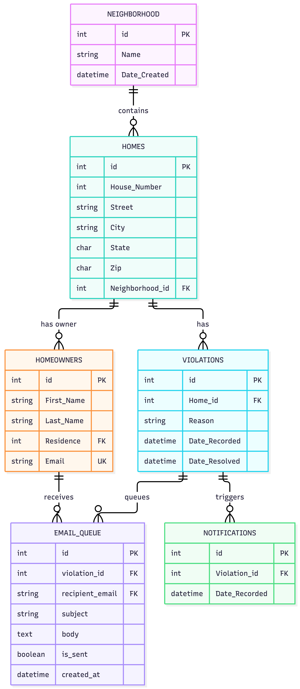

# Design Document

By Hunter Kiely

Video overview: <(https://youtu.be/JxoKjYr28I8)>

## Scope

The purpose of this database is to manage homeowner’s association violations and notifications for addresses listed in a subdivision.

Included in the databases scope are:
* Neighborhood
* Homes (addresses)
* Violations (active and resolved) & reason for violation
* Dates of notifications to homeowners
* Homeowners
* Emails pending send

The database has a static view of homeowners, contact information, and properties. This information will only be dynamic when multiple users have access to update their information. The information entered is a snapshot in time.

## Functional Requirements

* An administrator should be able to keep track of all homes and addresses in a neighborhood. Once basic address information has been entered, the will have a record of homes that have violations, when and what the violation was recorded for, how many notices were sent for the same violation, and when the violation was marked as resolved. The user should be able to query each data field individually. A view has been created where multiple tables are joined to make relating data easier.

* Beyond the scope of the software are fines assessed to homeowners and specific covenants violated.

## Representation

Entities are captured in MySQL tables with the following schema.

#### Neighborhood

The `neighborhood` table includes:
* ID, this specifies the unique ID for the neighborhood as an `UNSIGNED INT`. This column thus has the `PRIMARY KEY` constraint applied.
* Name, This specifies the name of the neighborhood as a `VARCHAR`(64). The varchar format is used because the input is variable length set of characters.

#### Homeowners
The `homeowners` table includes:
* ID, This specifies the unique ID for the homeowner as an `UNSIGNED INT`. This column thus has the `PRIMARY KEY` constraint applied.
* First Name, The first name of the owner as a `VARCHAR`(64).
* Last Name, The Last name of the owner as a `VARCHAR`(64).
* Residence, this should reference the homes table as a `FOREIGN KEY`.
* Email, The email of the owner as a `VARCHAR`(256).

#### Homes

The `homes` table includes:
* ID, This specifies the unique ID for the home as an `UNSIGNED INT`. This column thus has the `PRIMARY KEY` constraint applied.
* House Number, this specifies the house number for the home as an `INT`.
* Street, The name of the street as a `VARCHAR`(64).
* City, The city of the home as a `VARCHAR`(64). A variable length input which takes characters is needed.
* State, The state abbreviation as a `CHAR`(2). This will only allow two characters.
* Zip, The zip code abbreviation as a `CHAR`(6)
* Neighborhood, This is an `UNSIGNED INT` that will reference the neighborhood table as a `FOREIGN KEY`.

#### Violations

The `violations` table includes:
* ID, this specifies the unique ID for the violation as an `UNSIGNED INT`. This column thus has the `PRIMARY KEY` constraint applied.
* Home ID - This is an `UNSIGNED INT` and should reference the ID of the home in the `HOMES` table.
* Reason - This is a `VARCHAR`(1028) because it is a free text field.
* Date Recorded - the date the violation was entered into the table. This should be of type `DATETIME`. Properties are set to `DEFAULT CURRENT_TIMESTAMP` to record the time of the violation entry.
* Date Resolved - the date the violation was marked as resolved in the table. This should be of type `DATETIME`.

#### Notifications

The `notifications` table includes:

* ID, This specifies the unique ID for the Warning issued as an `UNSIGNED INT`. This column thus has the `PRIMARY KEY` constraint applied.
* Violation ID - This is an `UNSIGNED INT` and should reference the ID of the violation in the `violations` table.
* Home ID - This is an `UNSIGNED INT` and should reference the ID of the home in the `homes` table.
* Date of Notification - the date the notification was recorded as being sent in the table. This should be of type `DATETIME`.

#### Email Queue

The `email_queue` table includes:

* ID, This specifies the unique ID for the email message issued as an `UNSIGNED INT`. This column thus has the `PRIMARY KEY` constraint applied.
* Violation ID - This is an `UNSIGNED INT` and should reference the ID of the violation in the `violations` table.
* Recipient Email - The email of the owner as a `VARCHAR`(256). The column will reference the `homeowners` table as a foreign key.
* Subject - This will concatenate information from the `violations` table.
* Body - This will concatenate information from the `homeowners` and `violations` table
* Is Sent - This is a `BOOLEAN` value automatically set to `FALSE` until the message is sent.
* Created at - This is a `DATETIME` value created when the message was generated. The `DEFAULT CURRENT_TIMESTAMP` properties are applied

### Relationships

* A neighborhood is expected to be listed in the `neighborhood` table only one time. A single `Neighborhood_ID` can be listed on many homes on `homes` table. A home can't exist in many neighborhoods and will be classified with and reference only a single `neighborhood.id`.
* A home or address is expected to be listed in the `homes` table only one time as there is only one home per address.
* Multiple violations in the `violations` table can exist for a single home. Each are represented with a unique `violations.id` and a unique reason for the additional violation.
* Multiple notifications can exist for a single violation. Each notification created is linked to the same `violations.id`.

## Optimizations
* Because importing CSV files is blocked in this containerized version of the MySQL database, there is a limited amount of data. This made designing indexes to optimize queries challenging.

* One additional index was created on the violations table for the `Date_Resolved` column. This column will be searched for active violations. Typically, indexes are most likely to speed up the query when the EXPLAIN statement shows the table is being scanned.
    CREATE INDEX active_violation
    ON violations(Date_Resolved);

* Views were created for a simplified reporting experience for the user combining and showing relevant data across tables.
    * notifications_per_home - Creates the view showing notifications per violation, address and neighborhood listed.
        * This view can then be queried to select the count of notifications for each active violation and ordered by location.

    * homes_in_database
        * This view provides a simplified way to query all addresses entered into the database.

## Limitations

The current design assumes a one to many relationship, where one home can have many violations and each violation can have many notifications.
Because the design of the violation table, violations are not classified and are free text only. It would not be possible to query by classification of violation, such as all homes that have wood rot. However, specific keywords can be found within descriptions.
